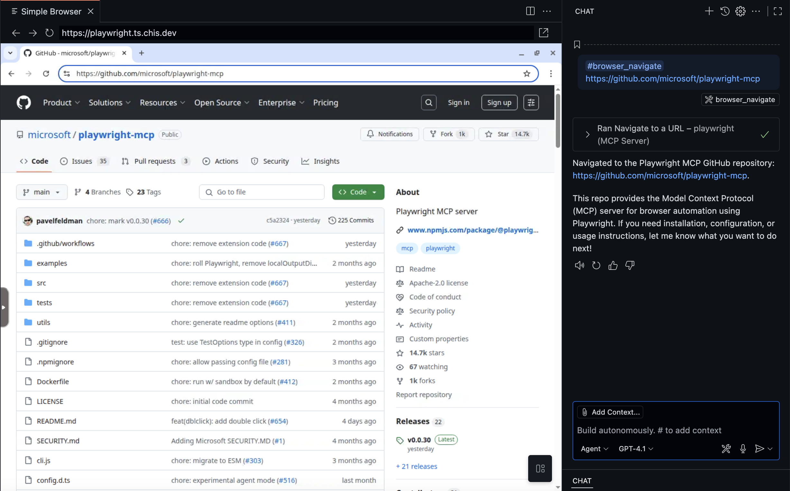
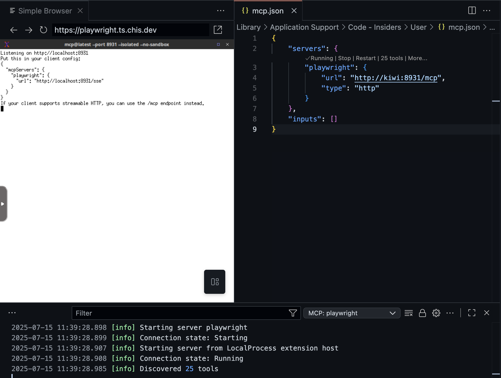

# Playwright MCP Server with KasmVNC

Run **headed** Playwright browser MCP on a **headless** remote server. No need to install Playwright on your local machine.

Browser within a browser, enabled by KasmVNC. Perfect for environments where you cannot run [Playwright MCP](https://github.com/microsoft/playwright-mcp) locally on the client. I've been using this to run [opencode](https://github.com/sst/opencode) through [WebSSH](https://webssh.net/) on my iPhone. This allows me to launch a Playwright browser and access it through my browser on iOS, bypassing the inability to run Playwright locally.



> **Warning:** This server is not security hardened. Do **not** expose it to the public internet. Only interact with the MCP server through localhost, port-forwarding, or a secure VPN (such as Tailscale).

## Features

- Headed Playwright browser automation through mcp server on port **8931**
- Accessible browser UI via KasmVNC on port **3000**
- Works with local/remote code editors (e.g., OpenCode, VSCode)

## Usage

### 1. Start the MCP Server (Docker)

You can build and run the MCP server using Docker:

```sh
# Build the Docker image
docker build -t playwright-desktop .
```

Then start the server, mapping both the MCP server and the KasmVNC UI ports:

```sh
# Run the container in detached mode
docker run \
  --name playwright-desktop \
  --shm-size=2g \             
  -p 8931:8931 \              # MCP server port
  -p 3000:3000 \              # KasmVNC UI port
  playwright-desktop           
```

This will run the Playwright MCP server in headed mode, listening on port `8931`, and expose the KasmVNC UI on port `3000`.

### 2. Access the Browser

- Port forward `localhost:3000` for external access to the KasmVNC UI.


### 3. Connect to Client

- Port forward `localhost:8391` for external access to the MCP server.

> Note: Here I am using tailscale to connect to my server using [MagicDNS](https://tailscale.com/kb/1081/magicdns)



